# How I Built an Agentic AI Assistant with RAG & LLM Gateway — A Complete Guide

**From "What is an LLM?" to production-grade AI architecture — everything I learned building an AI assistant for my PetClinic app.**

Most chatbots are just wrappers around an LLM. You type something, it guesses an answer from its training data, and half the time it's wrong.

The AI assistant I built for my PetClinic app is different. It **doesn't guess** — it looks things up. It queries the database, checks real vet records, books actual appointments, and searches a knowledge base for accurate pet care advice. When it says "Dr. Linda Douglas specializes in dentistry," that's coming from a database query, not a hallucination.

This article walks through **everything** — from basic concepts to advanced patterns. Whether you're a beginner learning what "LLM" means or a senior engineer evaluating AI architectures, you'll find your entry point here.

> **The Project:** This AI assistant is part of my TypeScript rebuild of the classic [Spring PetClinic](https://github.com/spring-projects/spring-petclinic) originally created by **Pivotal** (now VMware Tanzu). The full project uses React 19, Express 5, Tailwind CSS v4, and JWT authentication. This article focuses on the AI features.

---

## Table of Contents

1. [The Basics — What is an LLM?](#1-the-basics--what-is-an-llm)
2. [What Makes It "Agentic"?](#2-what-makes-it-agentic)
3. [The Architecture — Full Picture](#3-the-architecture--full-picture)
4. [AI Service — One Interface, Many Providers](#4-ai-service--one-interface-many-providers)
5. [MCP Tools — Giving the AI Hands](#5-mcp-tools--giving-the-ai-hands)
6. [The Agentic Loop — How Tool Calling Works](#6-the-agentic-loop--how-tool-calling-works)
7. [RAG — Teaching the AI Your Knowledge](#7-rag--teaching-the-ai-your-knowledge)
8. [LLM Gateway — Production-Grade Routing](#8-llm-gateway--production-grade-routing)
9. [Streaming — Real-Time Responses](#9-streaming--real-time-responses)
10. [The System Prompt — Shaping AI Behavior](#10-the-system-prompt--shaping-ai-behavior)
11. [The Chat Widget — Frontend UI](#11-the-chat-widget--frontend-ui)
12. [Security — Doing It Right](#12-security--doing-it-right)
13. [Problems I Solved](#13-problems-i-solved)
14. [Lessons Learned](#14-lessons-learned)

---

## 1. The Basics — What is an LLM?

<p align="center">
  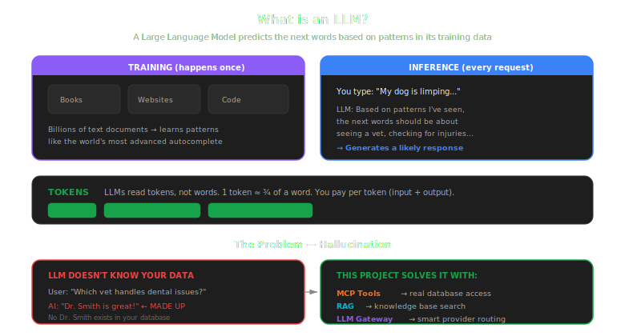
</p>

If you already know what LLMs, tokens, and prompts are, [skip to section 2](#2-what-makes-it-agentic).

### LLM (Large Language Model)

An LLM is a program trained on billions of text documents — books, websites, code, conversations. After training, it can predict what text should come next, given a starting input. That's it. That's the core trick.

When you type "My dog is limping, what should I do?", the LLM doesn't "understand" dogs or limping. It has seen millions of similar questions and answers during training, so it generates a statistically likely response. Think of it as the world's most sophisticated autocomplete.

```
You type:  "My dog is limping..."
LLM thinks: Based on patterns I've seen, the next words should be
            about seeing a vet, checking for injuries, etc.
LLM writes: "You should check for visible injuries and consult
             a veterinarian, especially if..."
```

Popular LLMs:
- **GPT-4o** (OpenAI) — general purpose, very capable
- **Claude** (Anthropic) — strong at reasoning and coding
- **Gemini** (Google) — has a generous free tier for developers

### Tokens

LLMs don't read words — they read **tokens**. A token is roughly 3/4 of a word. "veterinarian" is 3 tokens. "cat" is 1 token. You pay per token (input + output), which is why concise prompts save money.

### Prompt

A **prompt** is the text you send to the LLM. There are two types:
- **System prompt** — hidden instructions that shape behavior ("You are a helpful vet assistant")
- **User prompt** — the actual question the user typed

### The Problem with Vanilla LLMs

Here's the catch: LLMs only know what they were trained on. They don't know your database, your clinic's hours, or who "Dr. Linda Douglas" is. If you ask, they'll make something up confidently. This is called **hallucination**.

```
Regular LLM:
  User: "Which vet handles dental issues at your clinic?"
  AI:   "Dr. Smith is great with dental care!" ← MADE UP. No Dr. Smith exists.
```

This is the problem my project solves — with tools, RAG, and an LLM gateway.

---

## 2. What Makes It "Agentic"?

<p align="center">
  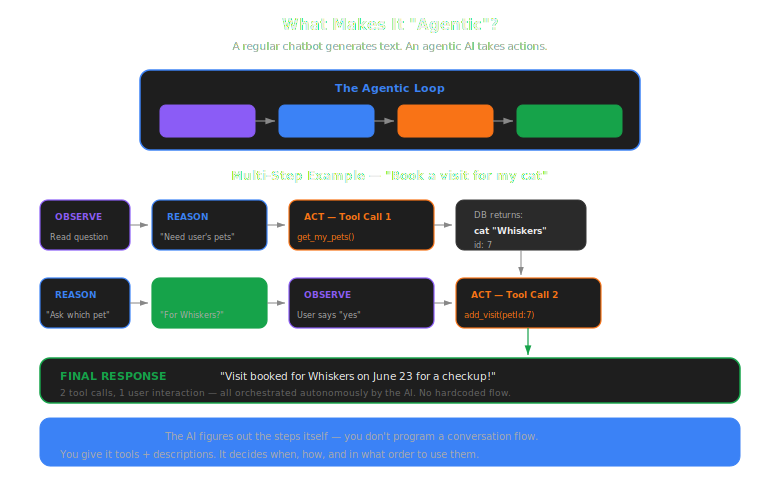
</p>

A **regular chatbot** generates text based on training data. An **agentic AI** can take actions — it calls functions, queries databases, and makes decisions.

Here's the difference:

```
┌─────────────────────────────────────────────────────────┐
│                    REGULAR CHATBOT                       │
│                                                         │
│  User: "Which vet handles dental issues?"               │
│  AI:   "I'd recommend looking for a vet who             │
│         specializes in dentistry." ← Generic guess      │
│                                                         │
│  ❌ No real data. Just paraphrasing training text.       │
└─────────────────────────────────────────────────────────┘

┌─────────────────────────────────────────────────────────┐
│                    AGENTIC AI                            │
│                                                         │
│  User: "Which vet handles dental issues?"               │
│                                                         │
│  AI thinks: "I should search for vets with dental       │
│              specialty in the database"                  │
│                                                         │
│  AI calls: search_vets({ specialty: "dentistry" })      │
│  Database: [{ "Dr. Linda Douglas", ["dentistry"] }]     │
│                                                         │
│  AI: "Dr. Linda Douglas specializes in dentistry        │
│       and surgery." ← REAL DATA from the database       │
│                                                         │
│  ✅ Real data. Zero hallucination.                       │
└─────────────────────────────────────────────────────────┘
```

The key concept is the **Observe → Reason → Act → Respond** loop:

```
         ┌──────────┐
         │ OBSERVE  │ ← Read the user's question
         └────┬─────┘
              │
         ┌────▼─────┐
         │ REASON   │ ← Decide what information is needed
         └────┬─────┘
              │
         ┌────▼─────┐
         │  ACT     │ ← Call tools (database queries, APIs)
         └────┬─────┘
              │
         ┌────▼─────┐
         │ RESPOND  │ ← Write answer using real data
         └──────────┘
```

And it can **chain multiple actions**. To book a visit, it:
1. Calls `get_my_pets` → finds the user's pets
2. Asks which pet → user says "Buddy"
3. Asks for a date → user says "next Monday"
4. Calls `add_visit` → creates the appointment
5. Confirms the booking with real details

That's 5 steps, 2 tool calls, and 3 user interactions — all orchestrated by the AI autonomously. No hardcoded conversation flow.

---

## 3. The Architecture — Full Picture

Here's every component and how data flows through the system:

<p align="center">
  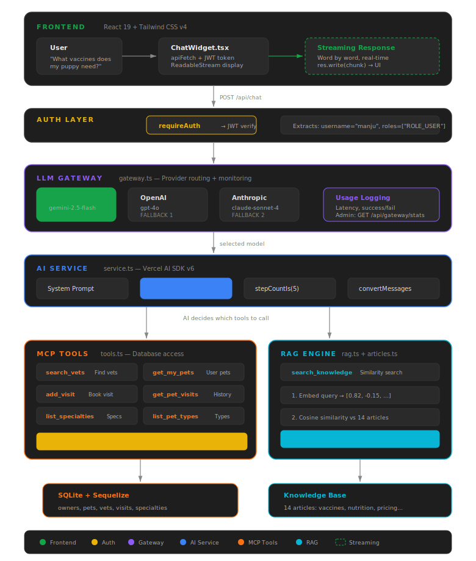
</p>

Let me break down each layer.

---

## 4. AI Service — One Interface, Many Providers

<p align="center">
  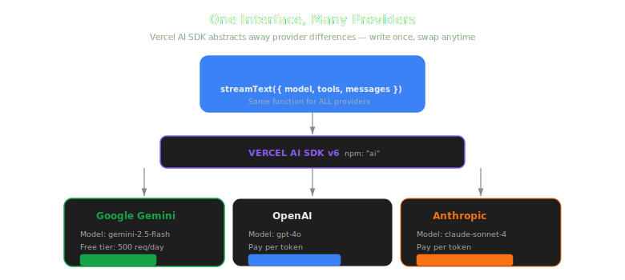
</p>

### The Problem

OpenAI, Anthropic, and Google all have different APIs:

```
OpenAI:    openai.chat.completions.create({ model: "gpt-4o", ... })
Anthropic: anthropic.messages.create({ model: "claude-sonnet-4-...", ... })
Google:    gemini.generateContent({ model: "gemini-2.5-flash", ... })
```

If you hardcode one provider, switching later means rewriting your backend.

### The Solution: Vercel AI SDK

The **[Vercel AI SDK](https://sdk.vercel.ai/)** (npm package: `ai`) gives you one unified interface for all providers. Think of it like Sequelize for databases — write once, swap the engine anytime.

```typescript
// All three providers use the same streamText() function:
import { streamText } from 'ai';

const result = streamText({
  model,    // ← Could be Gemini, GPT-4o, or Claude
  system: SYSTEM_PROMPT,
  messages,
  tools,
});
```

The `model` variable comes from the LLM Gateway, which handles provider selection (more on that in [section 8](#8-llm-gateway--production-grade-routing)).

### Why This Matters

- **Development:** Use Google Gemini (free tier — 500 req/day)
- **Production:** Switch to GPT-4o or Claude with one config change
- **No code changes, no redeployment**

---

## 5. MCP Tools — Giving the AI Hands

This is the most important section. Without tools, the AI is a text generator that makes things up. With tools, it becomes an **agent** that takes real actions.

<p align="center">
  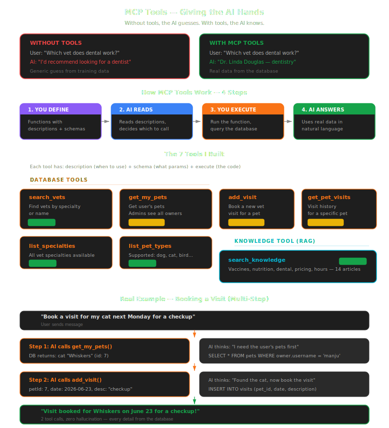
</p>

### What is MCP?

**MCP (Model Context Protocol)** is a standard introduced by Anthropic for connecting AI models to external data and actions. The AI never touches your database directly. It can only call the tools you define, with the parameters you specify. It's like giving a new employee access to specific filing cabinets — they can look things up, but only through the drawers you've opened.

### The 7 Tools I Built

Each tool has three parts:
- **Description** — tells the AI *when* to use it
- **Input schema** — defines *what parameters* it accepts (validated with Zod)
- **Execute function** — the actual code that runs

```typescript
// backend/src/ai/tools.ts

import { tool } from 'ai';
import { z } from 'zod';
import { searchKnowledge } from './knowledge/rag';

export function createPetClinicTools(username: string, roles: string[]) {
  const isAdmin = roles.includes('ROLE_ADMIN');

  return {
    search_vets: tool({
      description:
        'Search veterinarians by specialty or name. ' +
        'Use when users ask about available vets.',
      inputSchema: z.object({
        specialty: z.string().optional()
          .describe('Filter by specialty name'),
        name: z.string().optional()
          .describe('Filter by vet name'),
      }),
      execute: async ({ specialty, name }) => {
        let vets = await Vet.findAll({
          include: [{ model: Specialty, as: 'specialties' }],
        });
        if (specialty) {
          vets = vets.filter(v =>
            v.specialties?.some(s =>
              s.name.toLowerCase().includes(specialty.toLowerCase())
            )
          );
        }
        return vets.map(v => ({
          name: `Dr. ${v.first_name} ${v.last_name}`,
          specialties: v.specialties?.map(s => s.name) ?? [],
        }));
      },
    }),

    search_knowledge: tool({
      description:
        'Search the clinic knowledge base for pet care advice, ' +
        'pricing, services, and veterinary guidance.',
      inputSchema: z.object({
        query: z.string().describe('What the user wants to know'),
        category: z.enum(['pet-care', 'clinic']).optional(),
      }),
      execute: async ({ query, category }) => {
        return searchKnowledge(query, 3, category);
      },
    }),

    // ... 5 more tools
  };
}
```

### Complete Tool Reference

| Tool | Purpose | Who Can Use | Example Question |
|------|---------|-------------|-----------------|
| `search_vets` | Find vets by specialty or name | Everyone | "Which vet does surgery?" |
| `get_my_pets` | Get user's pets (admins see all) | Scoped by role | "What pets do I have?" |
| `get_pet_visits` | Get visit history for a pet | Owner / Admin | "Show Buddy's visit history" |
| `add_visit` | Book a new vet visit | Owner / Admin | "Book a checkup for my cat" |
| `list_specialties` | List all vet specialties | Everyone | "What specialties are available?" |
| `list_pet_types` | List supported pet types | Everyone | "What types of pets do you support?" |
| `search_knowledge` | Search knowledge base (RAG) | Everyone | "What vaccinations does a puppy need?" |

---

## 6. The Agentic Loop — How Tool Calling Works

<p align="center">
  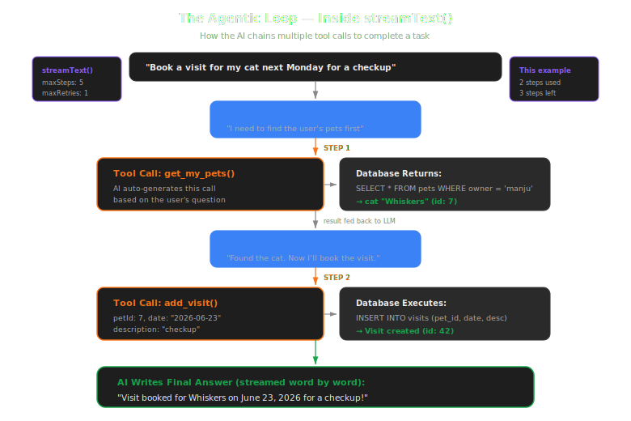
</p>

Here's what happens inside `streamText()` when the AI decides to use tools:

```
User message: "Book a visit for my cat next Monday"
                    │
                    ▼
            ┌───────────────┐
            │   LLM thinks  │
            │   "I need to  │
            │   find the    │
            │   user's pets │
            │   first"      │
            └───────┬───────┘
                    │
          Step 1    ▼
            ┌───────────────┐        ┌──────────────┐
            │  Tool call:   │───────▶│  Database:    │
            │  get_my_pets()│        │  SELECT pets  │
            │               │◀───────│  WHERE owner  │
            │  Result: cat  │        │  = 'manju'    │
            │  "Whiskers"   │        └──────────────┘
            │  id: 7        │
            └───────┬───────┘
                    │
            ┌───────▼───────┐
            │  LLM thinks   │
            │  "Found the   │
            │  cat. Now I   │
            │  need to book │
            │  the visit."  │
            └───────┬───────┘
                    │
          Step 2    ▼
            ┌───────────────┐        ┌──────────────┐
            │  Tool call:   │───────▶│  Database:    │
            │  add_visit(   │        │  INSERT INTO  │
            │    petId: 7,  │        │  visits       │
            │    date: ..., │◀───────│  (pet_id,     │
            │    desc: ...) │        │   date, desc) │
            │  Result: OK   │        └──────────────┘
            └───────┬───────┘
                    │
            ┌───────▼───────┐
            │  LLM writes   │
            │  final answer  │──▶  "Visit booked for Whiskers
            │  using real   │      on 2026-06-23 for a checkup."
            │  data         │
            └───────────────┘
```

The Vercel AI SDK handles this entire loop automatically:

```typescript
const result = streamText({
  model,
  system: SYSTEM_PROMPT,
  messages: modelMessages,
  tools,                          // All 7 tools
  maxRetries: 1,                  // Don't burn API quota
  stopWhen: stepCountIs(5),       // Allow up to 5 tool-calling steps
});
```

`stepCountIs(5)` means the AI can chain up to 5 tool calls per request. Booking a visit typically uses 2 steps. Complex admin queries might use 3-4.

---

## 7. RAG — Teaching the AI Your Knowledge

<p align="center">
  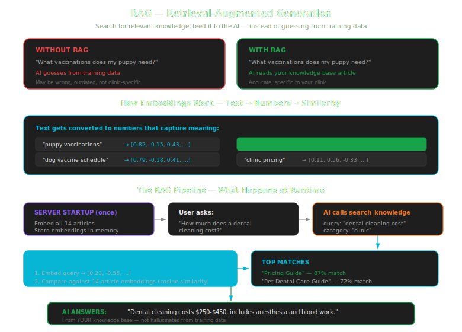
</p>

### What is RAG?

**RAG (Retrieval-Augmented Generation)** solves a fundamental LLM limitation: the AI doesn't know your specific information. It doesn't know your clinic's hours, your pricing, or your vaccination guidelines.

You *could* cram all this into the system prompt, but:
- System prompts have size limits
- You pay for every token in the prompt on every request
- It doesn't scale — 100 articles would blow past any limit

RAG is smarter. Instead of stuffing everything into the prompt, you **search** for the relevant information and only include what's needed:

```
┌─────────────────────────────────────────────────────────────┐
│                  WITHOUT RAG                                 │
│                                                             │
│  User: "What vaccinations does my puppy need?"              │
│  AI:   [Makes up generic vaccination info from training]    │
│  ❌ May be wrong, outdated, or not specific to your clinic   │
└─────────────────────────────────────────────────────────────┘

┌─────────────────────────────────────────────────────────────┐
│                  WITH RAG                                    │
│                                                             │
│  User: "What vaccinations does my puppy need?"              │
│                                                             │
│  Step 1: Embed the question → [0.12, -0.45, 0.78, ...]     │
│  Step 2: Search knowledge base by similarity                │
│  Step 3: Find "Dog Vaccination Schedule" article (92% match)│
│  Step 4: AI reads the article and answers from it           │
│                                                             │
│  AI: "Puppies need vaccinations starting at 6-8 weeks.      │
│       Core vaccines include Distemper, Parvovirus,          │
│       Adenovirus, and Rabies. Boosters every 3-4 weeks      │
│       until 16 weeks old." ← FROM YOUR KNOWLEDGE BASE       │
│  ✅ Accurate, specific to your clinic                        │
└─────────────────────────────────────────────────────────────┘
```

### How Embeddings Work

This is the key concept. An **embedding** is a way to turn text into numbers that capture its meaning.

```
"puppy vaccinations"  → [0.82, -0.15, 0.43, 0.67, ...]  (768 numbers)
"dog vaccine schedule" → [0.79, -0.18, 0.41, 0.71, ...]  (768 numbers)
"clinic pricing"       → [0.11, 0.56, -0.33, 0.22, ...]  (768 numbers)
```

Notice: "puppy vaccinations" and "dog vaccine schedule" have similar numbers — because they mean similar things! "clinic pricing" has very different numbers because it's about a different topic.

**Cosine similarity** measures how close two embeddings are (0 = unrelated, 1 = identical). By comparing the user's question embedding against all article embeddings, we find the most relevant articles.

### The Implementation

**Step 1: Knowledge Base** — 14 articles covering pet care and clinic info:

```typescript
// backend/src/ai/knowledge/articles.ts

export const KNOWLEDGE_BASE: KnowledgeArticle[] = [
  {
    id: 'vaccination-dogs',
    title: 'Dog Vaccination Schedule',
    category: 'pet-care',
    content: 'Puppies need vaccinations starting at 6-8 weeks old. ' +
             'Core vaccines include Distemper, Parvovirus, Adenovirus, ' +
             'and Rabies. Boosters every 3-4 weeks until 16 weeks...',
  },
  {
    id: 'clinic-pricing',
    title: 'Pricing Guide',
    category: 'clinic',
    content: 'Wellness exam: $55-$75. Vaccination packages: $85-$120...',
  },
  // ... 12 more articles
];
```

The knowledge base covers:
- **10 pet care articles** — vaccinations (dogs/cats), dental care, nutrition (dogs/cats), exercise, parasites, spay/neuter, emergency signs, senior pet care
- **4 clinic articles** — hours/location, services, new patient info, pricing

**Step 2: RAG Engine** — embed articles on startup, search by similarity:

```typescript
// backend/src/ai/knowledge/rag.ts

import { embed, embedMany, cosineSimilarity } from 'ai';

let embeddedArticles: EmbeddedArticle[] = [];

// Runs once on server startup
export async function initializeRAG(): Promise<void> {
  const model = getEmbeddingModel();  // Google's gemini-embedding-001
  const texts = KNOWLEDGE_BASE.map(a => `${a.title}. ${a.content}`);

  // Convert all 14 articles to number arrays (embeddings)
  const { embeddings } = await embedMany({ model, values: texts });

  embeddedArticles = KNOWLEDGE_BASE.map((article, i) => ({
    article,
    embedding: embeddings[i],
  }));
}

// Called by the search_knowledge tool
export async function searchKnowledge(query: string, topK = 3) {
  // Convert user's question to an embedding
  const { embedding: queryEmbedding } = await embed({
    model: getEmbeddingModel(),
    value: query,
  });

  // Compare against all articles using cosine similarity
  const scored = embeddedArticles.map(e => ({
    ...e.article,
    score: cosineSimilarity(queryEmbedding, e.embedding),
  }));

  // Return top 3 matches with score > 0.3
  scored.sort((a, b) => b.score - a.score);
  return scored.slice(0, topK).filter(s => s.score > 0.3);
}
```

**Step 3: The flow at runtime:**

```
Server starts:
  └── initializeRAG()
      └── Embeds 14 articles → stored in memory
          (takes ~2 seconds, runs once)

User asks: "How much does a dental cleaning cost?"
  │
  ▼
AI calls: search_knowledge({ query: "dental cleaning cost" })
  │
  ▼
RAG engine:
  ├── Embeds "dental cleaning cost" → [0.23, -0.56, ...]
  ├── Compares against 14 article embeddings
  ├── Top match: "Pricing Guide" (87% similarity)
  ├── Second match: "Pet Dental Care Guide" (72% similarity)
  └── Returns both articles to the AI
  │
  ▼
AI reads the articles and responds:
  "Dental cleaning costs $250-$450, which includes anesthesia
   and pre-anesthetic blood work. We recommend annual cleanings."
```

### Why Not Just Put Everything in the Prompt?

| Approach | Cost per Request | Scales to 1000 articles? | Accuracy |
|----------|-----------------|--------------------------|----------|
| All in system prompt | High (pay for every token, every request) | No (hits token limits) | Low (AI loses focus in long prompts) |
| RAG | Low (only relevant articles included) | Yes (search is O(n) similarity) | High (focused, relevant context) |

RAG is the industry-standard approach used by ChatGPT, Perplexity, and every serious AI product.

---

## 8. LLM Gateway — Production-Grade Routing

<p align="center">
  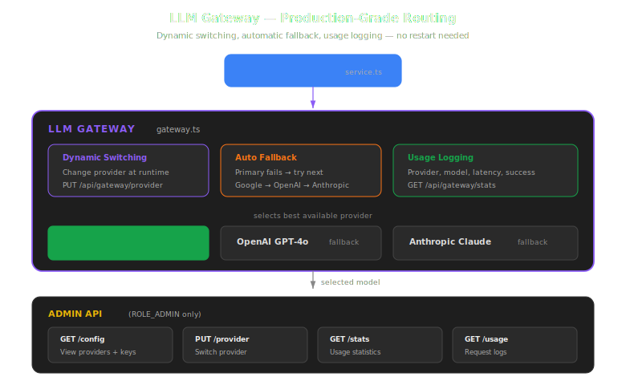
</p>

### The Problem

In early development, you hardcode one provider:

```typescript
const model = google('gemini-2.5-flash');
```

This works until:
- Google retires the model (happened to me — `gemini-2.0-flash` was silently retired)
- You hit the free tier limit (500 req/day)
- You want to compare model quality between providers
- You need to switch providers without restarting the server

### The Solution: LLM Gateway

The LLM Gateway is a routing layer between your app and the LLM providers. It handles:

```
┌─────────────────────────────────────────────────────────┐
│                    LLM GATEWAY                           │
│                                                         │
│  ┌───────────────────────────────────────────────────┐  │
│  │  Dynamic Provider Switching                        │  │
│  │  Change providers at runtime via API — no restart  │  │
│  │  PUT /api/gateway/provider { "provider": "openai" }│  │
│  └───────────────────────────────────────────────────┘  │
│                                                         │
│  ┌───────────────────────────────────────────────────┐  │
│  │  Automatic Fallback                                │  │
│  │  Primary: Google Gemini                            │  │
│  │  Fallback 1: OpenAI GPT-4o                         │  │
│  │  Fallback 2: Anthropic Claude                      │  │
│  │  If primary has no API key → try next available     │  │
│  └───────────────────────────────────────────────────┘  │
│                                                         │
│  ┌───────────────────────────────────────────────────┐  │
│  │  Usage Logging                                     │  │
│  │  Every request logged with:                        │  │
│  │  • Provider + model used                           │  │
│  │  • Latency (ms)                                    │  │
│  │  • Success / failure                               │  │
│  │  • Username                                        │  │
│  └───────────────────────────────────────────────────┘  │
│                                                         │
│  ┌───────────────────────────────────────────────────┐  │
│  │  Admin API                                         │  │
│  │  GET  /api/gateway/config  — view current setup    │  │
│  │  PUT  /api/gateway/provider — switch provider      │  │
│  │  PUT  /api/gateway/model  — change model           │  │
│  │  GET  /api/gateway/stats  — usage statistics       │  │
│  │  GET  /api/gateway/usage  — request logs           │  │
│  └───────────────────────────────────────────────────┘  │
└─────────────────────────────────────────────────────────┘
```

### The Code

```typescript
// backend/src/ai/gateway.ts

class LLMGateway {
  private primary: ProviderName;       // 'google' | 'openai' | 'anthropic'
  private fallbackOrder: ProviderName[];
  private usageLog: UsageLogEntry[];

  // Returns the best available model
  async getModelWithFallback() {
    for (const provider of this.fallbackOrder) {
      if (this.hasApiKey(provider)) {
        return { model: this.createModel(provider), provider };
      }
    }
    // Last resort: try primary even without key (will error with clear message)
    return { model: this.createModel(this.primary), provider: this.primary };
  }

  // Switch provider at runtime — no restart needed
  setPrimary(provider: ProviderName) {
    this.primary = provider;
    this.fallbackOrder = this.buildFallbackOrder();
  }

  // Log every request for monitoring
  logUsage(entry: UsageLogEntry) {
    this.usageLog.push(entry);
  }
}

export const llmGateway = new LLMGateway();
```

### How service.ts Uses the Gateway

```typescript
// backend/src/ai/service.ts

export async function chatStream(req: ChatRequest) {
  // Gateway picks the best available provider
  const { model, provider } = await llmGateway.getModelWithFallback();

  const startTime = Date.now();

  const result = streamText({
    model,
    system: SYSTEM_PROMPT,
    messages: modelMessages,
    tools,
    onFinish: () => {
      // Log successful request
      llmGateway.logUsage({
        provider,
        model: modelName,
        latencyMs: Date.now() - startTime,
        success: true,
        username: req.username,
      });
    },
    onError: (event) => {
      // Log failed request
      llmGateway.logUsage({
        provider,
        model: modelName,
        latencyMs: Date.now() - startTime,
        success: false,
        error: String(event.error),
      });
    },
  });

  return result;
}
```

### Admin API Endpoints

```bash
# View current config — which providers are available
GET /api/gateway/config
Response:
{
  "primary": "google",
  "fallbackOrder": ["google", "openai", "anthropic"],
  "providers": [
    { "name": "google",    "model": "gemini-2.5-flash",        "available": true  },
    { "name": "openai",    "model": "gpt-4o",                  "available": false },
    { "name": "anthropic", "model": "claude-sonnet-4-20250514", "available": false }
  ]
}

# Switch to OpenAI at runtime
PUT /api/gateway/provider
Body: { "provider": "openai" }

# View usage statistics
GET /api/gateway/stats
Response:
{
  "totalRequests": 47,
  "successRate": "95.7%",
  "byProvider": {
    "google": { "count": 45, "avgLatencyMs": 1234, "errors": 2 },
    "openai": { "count": 2,  "avgLatencyMs": 890,  "errors": 0 }
  }
}
```

---

## 9. Streaming — Real-Time Responses

<p align="center">
  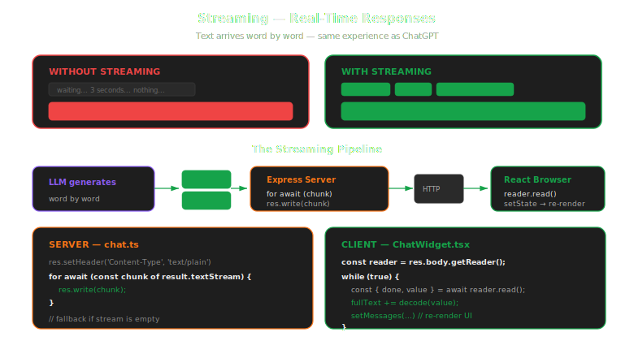
</p>

Without streaming, the user waits 3-5 seconds staring at nothing, then gets a wall of text. With streaming, they see the answer appear word by word — same as ChatGPT.

### Server Side

```typescript
// backend/src/routes/chat.ts

router.post('/', requireAuth, async (req, res) => {
  const result = await chatStream({
    messages: req.body.messages,
    username: req.user.username,
    roles: req.user.roles,
  });

  res.setHeader('Content-Type', 'text/plain; charset=utf-8');

  let hasContent = false;
  for await (const chunk of result.textStream) {
    hasContent = true;
    res.write(chunk);    // Send each chunk immediately to the browser
  }

  if (!hasContent) {
    res.write("Sorry, the AI service is temporarily unavailable.");
  }
  res.end();
});
```

`result.textStream` is an **async iterable** — each iteration yields a few words. We write them to the HTTP response immediately. The `hasContent` check handles silent failures (see [Problems I Solved](#13-problems-i-solved)).

### Client Side

```typescript
// frontend/src/components/chat/ChatWidget.tsx

const res = await apiFetch('api/chat', {
  method: 'POST',
  headers: { 'Content-Type': 'application/json' },
  body: JSON.stringify({ messages }),
});

// Read response as a stream, not all at once
const reader = res.body.getReader();
const decoder = new TextDecoder();
let fullText = '';

while (true) {
  const { done, value } = await reader.read();
  if (done) break;

  const chunk = decoder.decode(value, { stream: true });
  fullText += chunk;

  // Update React state → UI re-renders as each chunk arrives
  setMessages(prev =>
    prev.map(m => m.id === assistantId
      ? { ...m, content: fullText }
      : m
    )
  );
}
```

### Why Not `useChat`?

The Vercel AI SDK provides a `useChat` React hook that handles streaming automatically. But it manages its own HTTP requests — which doesn't work with our JWT authentication. Our app uses `apiFetch()`, a custom wrapper that attaches Bearer tokens and handles refresh. `useChat` would bypass all of that.

| Feature | `useChat` Hook | Manual `ReadableStream` |
|---------|---------------|------------------------|
| Lines of code | ~5 | ~30 |
| Custom auth | No | Yes |
| Token refresh | No | Yes (via `apiFetch`) |
| Best for | New projects | Existing apps with auth |

---

## 10. The System Prompt — Shaping AI Behavior

<p align="center">
  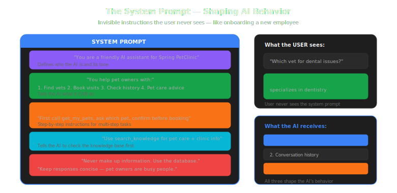
</p>

The system prompt is invisible instructions that shape how the AI behaves. It's like onboarding a new employee:

```typescript
const SYSTEM_PROMPT = `You are a friendly AI assistant for the Spring
PetClinic veterinary clinic. You help pet owners manage their pets
and visits.

When dealing with vets:
- Search by relevant specialty (surgery for injuries, dentistry
  for dental issues)
- For emergencies, prioritize vets with surgery specialty

When helping book visits:
- First call get_my_pets to check what pets the user has
- Ask which pet, what date, what symptoms
- Confirm ALL details before calling add_visit

You also have access to a knowledge base via search_knowledge.
Use it for pet care topics and clinic information instead of
relying on your general knowledge.

Keep responses concise — pet owners are busy people.`;
```

The prompt tells the AI:
- **What it is** — a PetClinic assistant
- **How to behave** — professional, warm, concise
- **When to use tools** — search vets by specialty, confirm before booking
- **When to use RAG** — pet care questions, clinic info
- **What never to do** — never make up data

---

## 11. The Chat Widget — Frontend UI

The chat widget is a self-contained React component styled entirely with Tailwind CSS:

```
┌─────────────────────────────────────────┐
│  🐾 PetClinic Assistant         ─  ✕   │
│  ● Online                               │
├─────────────────────────────────────────┤
│                                         │
│  ┌─── Assistant ──────────────────────┐ │
│  │ Hello! I'm the PetClinic AI       │ │
│  │ assistant. How can I help?         │ │
│  └────────────────────────────────────┘ │
│                                         │
│  ┌─────── Suggestions ───────────────┐  │
│  │ [Show my pets] [Find a vet]       │  │
│  │ [Book a visit] [Clinic hours]     │  │
│  └───────────────────────────────────┘  │
│                                         │
│  ┌─── You ────────────────────────────┐ │
│  │ What vaccinations does my          │ │
│  │ puppy need?                        │ │
│  └────────────────────────────────────┘ │
│                                         │
│  ┌─── Assistant ──────────────────────┐ │
│  │ Puppies need vaccinations starting │ │
│  │ at 6-8 weeks. Core vaccines       │ │
│  │ include Distemper, Parvovirus...█  │ │
│  └────────────────────── (streaming) ─┘ │
│                                         │
├─────────────────────────────────────────┤
│  [Type your message...        ] [Send]  │
└─────────────────────────────────────────┘
```

Features:
- **Floating green bubble** — bottom-right corner, toggles open/close
- **Quick suggestions** — clickable buttons for common questions
- **Streaming display** — text appears word by word
- **Typing indicator** — animated dots while AI is thinking
- **Timestamps** on every message
- **Shift+Enter** for newlines, Enter to send
- **Auth-aware** — only visible when logged in

All styled with Tailwind utility classes — zero custom CSS.

---

## 12. Security — Doing It Right

<p align="center">
  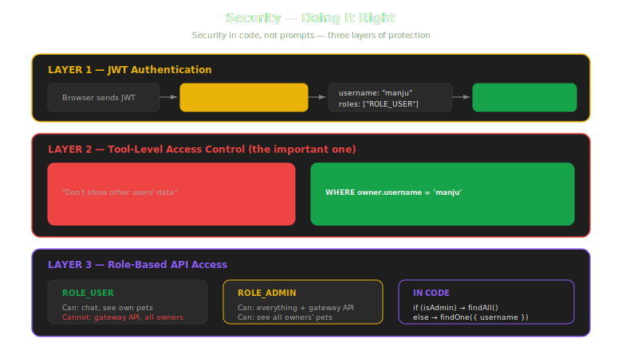
</p>

### Tool-Level Security (Not Prompt-Level)

You might be tempted to write "don't show other users' data" in the system prompt. **Don't.** Prompt instructions are suggestions the AI can ignore.

Real security lives in the `execute` function:

```typescript
get_my_pets: tool({
  execute: async ({ ownerName }) => {
    // Regular user → database filters by their username
    if (!isAdmin) {
      const owner = await Owner.findOne({ where: { username } });
      return owner.pets;  // Only their own pets
    }

    // Admin → can search by owner name
    if (isAdmin && ownerName) {
      return Owner.findAll({ where: { name: ownerName } });
    }
  },
}),
```

The database query filters by `username` **before** data reaches the AI. No prompt injection can bypass code-level filtering.

### JWT Authentication Flow

Every chat request goes through the same auth middleware as every other API endpoint:

```
Browser → POST /api/chat (Authorization: Bearer eyJhbGci...)
  │
  ├── requireAuth middleware → validates JWT signature + expiry
  ├── Extracts: { username: "manju", roles: ["ROLE_USER"] }
  ├── Passes username + roles to chatStream()
  └── chatStream creates tools scoped to that user
```

### Gateway Security

The gateway admin API is restricted to `ROLE_ADMIN`:

```typescript
router.get('/config', requireRole('ROLE_ADMIN'), handler);
router.put('/provider', requireRole('ROLE_ADMIN'), handler);
```

Regular users can chat. Only admins can view logs or switch providers.

---

## 13. Problems I Solved

### 1. Silent Model Retirement
Google retired `gemini-2.0-flash` without warning. The AI returned empty responses — no error, just nothing. `streamText()` produced an empty stream because the model no longer existed.

**Fix:** Updated to `gemini-2.5-flash` and added the `hasContent` fallback check. The LLM Gateway's fallback mechanism now also protects against this.

### 2. Embedding Model Discovery
Google's embedding API uses different model names than their chat API. `text-embedding-004` didn't work. Had to query the `ListModels` API to discover `gemini-embedding-001` was the available embedding model.

**Fix:** Called `curl "https://generativelanguage.googleapis.com/v1beta/models?key=..."` and filtered for models supporting `embedContent`.

### 3. Silent Stream Errors
When the LLM API fails (quota exceeded, invalid key), `streamText` returns a 200 response with an empty stream. The user sees a blank chat bubble.

**Fix:** Count chunks and write a fallback message if no content was produced.

### 4. Admin Data Access
The first version scoped all tools to the logged-in user. Admin users couldn't ask "which owner has the most pets?"

**Fix:** Pass `roles` from JWT through to tools. Check `isAdmin` before database queries.

### 5. Quota Management
Gemini's free tier is limited (500 req/day). The SDK retried failed requests 3 times by default, burning quota 3x faster.

**Fix:** Set `maxRetries: 1`. The LLM Gateway now tracks usage so you can monitor quota consumption.

---

## 14. Lessons Learned

**1. Tools are the real power, not the LLM.** GPT-4o, Gemini, Claude — they all work fine as the "brain." What makes the assistant useful is the structured database access through tools. Without tools, you have a chatbot that guesses. With tools, you have a chatbot that knows.

**2. RAG beats prompt stuffing.** Don't cram all your knowledge into the system prompt. Use embeddings and similarity search to find the relevant information for each question. It's cheaper, scales better, and gives more accurate answers.

**3. Security belongs in code, not prompts.** Prompt instructions are suggestions. Real access control lives in the `execute` function — database queries filter by `username` before data reaches the AI. No prompt injection can bypass code-level filtering.

**4. Multi-provider support is almost free.** The Vercel AI SDK abstracts away provider differences. Switching from Gemini to GPT-4o is one config change. Start with a free provider for dev, switch to paid for prod.

**5. An LLM Gateway pays for itself immediately.** Dynamic provider switching, usage logging, and fallback handling aren't "nice to have" — they're essential once you go beyond prototype. You will hit model retirements, quota limits, and outages. The gateway handles all of it.

**6. Streaming UX matters more than you think.** Users will wait 3 seconds for a response they can read as it appears. They won't wait 3 seconds for a blank screen followed by a wall of text. Same wait time, completely different perception.

**7. You can add AI to an existing app incrementally.** I didn't rewrite the app. The rest of the app is completely unchanged. AI is an additional layer, not a replacement.

---

## Tech Stack

| Component | Technology |
|-----------|-----------|
| AI SDK | Vercel AI SDK v6 (`ai` package) |
| LLM Providers | Google Gemini, OpenAI GPT-4o, Anthropic Claude |
| LLM Gateway | Custom routing layer with failover + logging |
| RAG | Cosine similarity search with `gemini-embedding-001` |
| Tool Framework | MCP-style tools with Zod schemas |
| Backend | TypeScript + Express 5 |
| Frontend | React 19 + Tailwind CSS v4 |
| Database | SQLite + Sequelize |
| Auth | JWT Bearer tokens |
| Streaming | `textStream` (server) + `ReadableStream` (browser) |

---

## File Structure

```
backend/src/ai/
├── gateway.ts              # LLM Gateway — provider routing, fallback, logging
├── service.ts              # System prompt, streamText(), usage tracking
├── tools.ts                # 7 MCP tools with Zod schemas and DB queries
└── knowledge/
    ├── articles.ts         # 14 knowledge articles (pet care + clinic info)
    └── rag.ts              # RAG engine — embeddings, cosine similarity search

backend/src/routes/
├── chat.ts                 # POST /api/chat — streaming chat endpoint
└── gateway.ts              # Admin API — provider switching, usage stats

frontend/src/components/chat/
└── ChatWidget.tsx          # React chat widget — fully Tailwind CSS
```

**8 files.** That's all it took to add an agentic AI assistant with RAG and an LLM Gateway to an existing full-stack application.

---

## Glossary

| Term | What It Means |
|------|--------------|
| **LLM** | Large Language Model — AI trained on text that generates responses |
| **Agentic AI** | AI that can take actions (call functions), not just generate text |
| **MCP** | Model Context Protocol — standard for connecting AI to external tools |
| **RAG** | Retrieval-Augmented Generation — search for relevant info, feed it to the AI |
| **Embedding** | Converting text to numbers that capture meaning (for similarity search) |
| **Cosine Similarity** | Math formula to measure how similar two embeddings are (0→1) |
| **Streaming** | Sending response word by word instead of waiting for the full answer |
| **System Prompt** | Hidden instructions that shape how the AI behaves |
| **Tool Calling** | AI deciding to call a function to get real data |
| **LLM Gateway** | Routing layer that manages multiple AI providers |
| **Fallback** | Automatically switching to another provider if the primary fails |
| **JWT** | JSON Web Token — authentication standard used for API access |

---

**Credits:** The PetClinic domain model originates from the [Spring PetClinic](https://github.com/spring-projects/spring-petclinic) by **Pivotal** (now VMware Tanzu). The AI assistant concept was inspired by the [official Spring PetClinic AI blog series](https://spring.io/blog/2024/09/26/ai-meets-spring-petclinic-implementing-an-ai-assistant-with-spring-ai-part-i). This TypeScript implementation and all application code are original.

Full source code: [https://github.com/Manju1306/PetClinic](https://github.com/Manju1306/PetClinic)

---

*Built with Vercel AI SDK v6.
