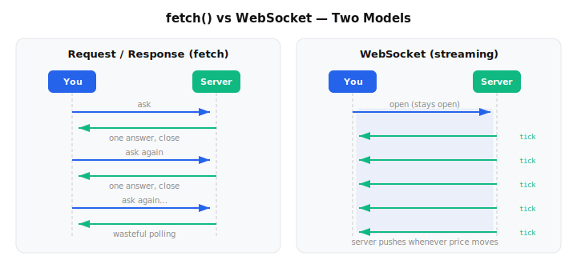
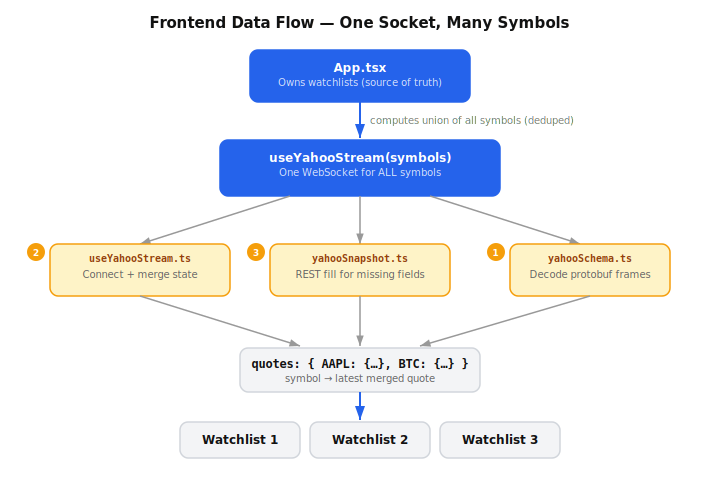
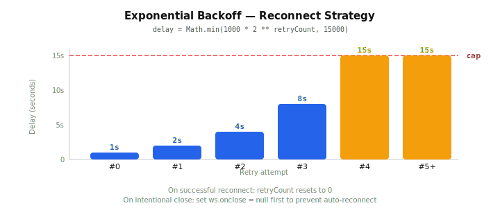
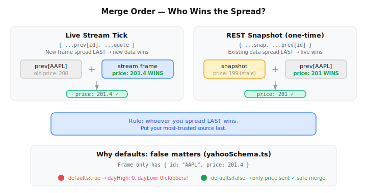

# Building a Real-Time Stock Watchlist in React: A Step-by-Step Guide

*Written for junior developers by a senior fullstack engineer. If you've built CRUD apps with `fetch` and want to level up to **live, streaming** data, this one is for you.*

---

## Table of contents

1. [What we're building](#1-what-were-building)
2. [Background: why streaming is different from `fetch`](#2-background-why-streaming-is-different-from-fetch)
3. [The mental model: one socket, many symbols](#3-the-mental-model-one-socket-many-symbols)
4. [Step 1 — Decode the wire format (`yahooSchema.ts`)](#4-step-1--decode-the-wire-format-yahooschemats)
5. [Step 2 — Manage the socket with a React hook (`useYahooStream.ts`)](#5-step-2--manage-the-socket-with-a-react-hook-useyahoostreamts)
6. [Step 3 — Fill the gaps with a REST snapshot (`yahooSnapshot.ts`)](#6-step-3--fill-the-gaps-with-a-rest-snapshot-yahoosnapshotts)
7. [Step 4 — Render the tape (`App.tsx`)](#7-step-4--render-the-tape-apptsx)
8. [Why a proxy sits in the middle](#8-why-a-proxy-sits-in-the-middle)
9. [Running it locally](#9-running-it-locally)
10. [Common pitfalls (and how we avoided them)](#10-common-pitfalls-and-how-we-avoided-them)
11. [Recap](#11-recap)

---

## 1. What we're building

A web app that shows a **live tape** of stock, crypto, and FX prices — the kind of
flashing green/red ticker you see on a trading desk. You type a symbol like `AAPL`
or `BTC-USD`, and the price updates in real time as the market moves. You can
organize symbols into multiple watchlists, drag the panels around, and everything
persists across reloads.

Under the hood it streams quotes from Yahoo Finance's **unofficial, undocumented**
WebSocket — the same feed their own website uses. The entire client-side data path
is just **three small files**, and that's the part I want to teach you, because the
patterns here (decode → manage connection → merge state → render) apply to *any*
real-time feature: chat, live dashboards, multiplayer cursors, you name it.

> **A note on the stack.** You don't need to be an expert in any of this. If you can
> read a React component and you understand `useState`/`useEffect`, you'll follow
> along fine. Here's the full toolbox, and *why* each piece is here:
>
> | Layer | Tool | Why it's in the project |
> | --- | --- | --- |
> | **Framework** | [React 18](https://react.dev/) + [TypeScript](https://www.typescriptlang.org/) | Components + hooks for the UI; strict types catch wire-format mistakes at compile time |
> | **Build tool** | [Vite 5](https://vite.dev/) | Instant dev server + fast production bundles; also supplies the `import.meta.env` config vars |
> | **Routing** | [React Router 7](https://reactrouter.com/) | A shared `<Layout>` shell wraps the routed page, so the WebSocket survives navigation |
> | **Decoding** | [protobufjs](https://www.npmjs.com/package/protobufjs) | Parses the base64-protobuf frames Yahoo streams (the star of Step 1) |
> | **Layout** | [react-grid-layout](https://github.com/react-grid-layout/react-grid-layout) | The draggable, resizable watchlist widgets, with positions persisted to `localStorage` |
> | **Styling** | [Tailwind CSS v4](https://tailwindcss.com/) + hand-written CSS | Utility classes for new UI, plus a big custom stylesheet for the trading-terminal look |
> | **Components** | [shadcn/ui](https://ui.shadcn.com/) on [Radix UI](https://www.radix-ui.com/) | Accessible primitives (button, input, the preferences `Dialog` + `Switch`) you own the source of |
> | **Icons** | [lucide-react](https://lucide.dev/) | Crisp SVG icons for the nav and controls |
>
> The interesting, transferable problems all live in the three data-path files
> (`yahooSchema.ts`, `useYahooStream.ts`, `yahooSnapshot.ts`). Everything else above
> is conventional React app scaffolding — useful to recognize, not essential to the
> streaming lesson.

---

## 2. Background: why streaming is different from `fetch`

Most apps you've built so far follow a **request/response** pattern:

```
You ask  ──────────────▶  Server
You wait
You get  ◀──────────────  Server (one answer, connection closes)
```

That's `fetch()`. It's perfect for "give me the current user" or "save this form."
But it's a terrible fit for prices, because prices change **continuously** and you
don't know *when*. Polling (calling `fetch` every second in a loop) is wasteful,
laggy, and hammers the server.

A **WebSocket** flips the model. You open one connection and keep it open. The
server can push you data the instant something happens:

```
You open  ─────────────▶  Server   (connection stays open)
          ◀───── tick ──  Server
          ◀───── tick ──  Server
          ◀───── tick ──  Server   (whenever a price moves)
```

Here's a visual comparison of the two models:

<p align="center">
  
</p>

This brings three new problems you didn't have with `fetch`, and **most of our code
exists to solve exactly these three**:

1. **Decoding.** The server doesn't send tidy JSON — it sends compact binary frames.
   We have to turn bytes into objects.
2. **Connection lifecycle.** Sockets drop. Wi-Fi blips, laptops sleep, servers
   restart. We need to reconnect gracefully without spamming the server.
3. **State merging.** Updates arrive *piecemeal* — one frame might carry only a new
   price, another only a new volume. We have to merge them so we don't lose data.

Keep these three in mind. Every step below maps to one of them.

---

## 3. The mental model: one socket, many symbols

Here's the data flow for the whole app:

<p align="center">
  
</p>

The key design decision: **one socket, not one-per-symbol**. If you have three
watchlists showing fifteen symbols, you still open exactly **one** connection. The
hook computes the *union* of all symbols and subscribes once. This is dramatically
simpler and cheaper than juggling fifteen sockets, and it's a pattern worth
internalizing: *centralize the expensive resource, fan out the cheap reads.*

Now let's build each piece.

---

## 4. Step 1 — Decode the wire format (`yahooSchema.ts`)

**Problem this solves:** decoding (problem #1 above).

When a frame arrives over the socket, it's not JSON. It's a **base64-encoded
[Protocol Buffer](https://protobuf.dev/)** (protobuf). Protobuf is a compact binary
format — great for bandwidth, useless to read by eye. To decode it we need the
**schema** (the field layout), and we use the [`protobufjs`](https://www.npmjs.com/package/protobufjs)
library to do the parsing.

Because this endpoint is undocumented, the schema is a community-maintained `.proto`
definition that we embed inline as a string and parse once at module load:

```ts
// yahooSchema.ts (abridged)
import protobuf from "protobufjs";
import type { Quote } from "./types";

const PROTO = `
syntax = "proto3";
message PricingData {
  string id = 1;        // the symbol, e.g. "AAPL"
  float  price = 2;
  sint64 time = 3;
  float  changePercent = 8;
  sint64 dayVolume = 9;
  float  dayHigh = 10;
  float  dayLow = 11;
  string shortName = 13;
  // ...~30 more fields
}
`;

// Parse the schema ONCE when the module loads, not on every message.
const root = protobuf.parse(PROTO).root;
const PricingData = root.lookupType("PricingData");
```

> **Why parse once at module load?** Parsing the schema is the expensive part.
> Decoding an individual message against an already-parsed schema is cheap. We do
> the heavy work a single time when the file is first imported, then reuse
> `PricingData` for every frame. Doing it per-message would be a classic
> performance footgun.

Now the actual decode function. There are **three defensive details** here that
look like paranoia but are actually battle scars. I'll annotate each:

```ts
export function decodeMessage(raw: string): Quote | null {
  let b64 = raw;

  // ── Detail #1: frames come in two shapes. ──────────────────────────
  // Sometimes Yahoo sends the base64 string directly; sometimes it wraps
  // it in JSON like { type: "pricing", message: "<base64>" }. Handle both.
  try {
    const parsed = JSON.parse(raw);
    if (parsed && typeof parsed.message === "string") b64 = parsed.message;
    else if (parsed && !parsed.message) return null; // handshake/status frame
  } catch {
    // Not JSON — assume `raw` is already the base64 payload.
  }

  try {
    const bytes = base64ToBytes(b64);
    const decoded = PricingData.decode(bytes);

    // ── Detail #2: defaults:false. THIS IS THE IMPORTANT ONE. ─────────
    // We only return fields the frame actually carried. If a tick update
    // contains just `price`, we must NOT emit dayHigh:0, dayLow:0, etc.,
    // or we'd clobber good values we already had. (More on this in Step 2.)
    return PricingData.toObject(decoded, {
      longs: Number,
      enums: String,
      defaults: false,
    }) as Quote;
  } catch {
    // ── Detail #3: never throw on junk. ──────────────────────────────
    // Heartbeats and handshakes aren't decodable. Return null and let the
    // caller ignore them rather than crashing the whole stream.
    return null;
  }
}
```

The function returns a typed `Quote | null`. `null` means "this frame wasn't a
quote — ignore it." This is a really useful pattern: **push the messiness to the
edge and hand the rest of your app clean, typed data.** Everything downstream gets
to assume "if it's not null, it's a real quote."

> **Takeaway for juniors:** when you integrate with something you don't control,
> code defensively at the boundary. Validate, handle multiple shapes, and *never*
> let a single malformed message take down your stream. The three `try/catch`
> blocks above aren't sloppy — they're the whole point.

---

## 5. Step 2 — Manage the socket with a React hook (`useYahooStream.ts`)

**Problem this solves:** connection lifecycle (#2) and state merging (#3).

This is the heart of the app. We wrap all the WebSocket logic in a custom hook so
the UI never has to think about sockets — it just calls `useYahooStream(symbols)`
and gets back live data. The hook's public shape:

```ts
export interface YahooStream {
  quotes: QuoteMap;             // symbol → latest merged quote
  status: ConnectionStatus;     // "connecting" | "open" | "closed" | "error"
  lastUpdate: number | null;    // timestamp of the last frame
  reconnect: () => void;        // manual reconnect button
}

export function useYahooStream(symbols: string[]): YahooStream { /* ... */ }
```

Let's walk through the four responsibilities.

### 5a. Opening the connection

```ts
const STREAM_URL =
  import.meta.env.VITE_STREAM_URL ?? "ws://localhost:8080/yahoo-stream";

const connect = useCallback(() => {
  clearTimeout(reconnectTimer.current);
  setStatus("connecting");

  let ws: WebSocket;
  try {
    ws = new WebSocket(STREAM_URL);
  } catch {
    setStatus("error");
    return;
  }
  wsRef.current = ws;

  ws.onopen = () => {
    retryRef.current = 0;                    // reset backoff on success
    setStatus("open");
    subscribe(ws, symbolsRef.current);       // tell the server what we want
  };
  // ... onmessage / onerror / onclose below
}, [subscribe]);
```

Notice the URL is configurable via an environment variable (`VITE_STREAM_URL`) with
a sensible localhost default. **Always make external URLs configurable** — you'll
thank yourself when you deploy.

### 5b. Subscribing — and why we use a `ref`

To start receiving quotes, we send a JSON subscribe message:

```ts
const subscribe = useCallback((ws: WebSocket | null, syms: string[]) => {
  if (ws && ws.readyState === WebSocket.OPEN && syms.length) {
    ws.send(JSON.stringify({ subscribe: syms }));
  }
}, []);
```

There's a subtle React problem hiding here. Our `connect` function is wrapped in
`useCallback` so it stays stable (we don't want to re-open the socket on every
render). But a stable callback "closes over" the `symbols` value from the render
where it was created — it would go **stale**. If the user adds a symbol, `connect`
would still remember the old list.

The fix is a **ref that always points at the latest value**:

```ts
const symbolsRef = useRef(symbols);
symbolsRef.current = symbols;   // updated on every render
```

Inside `onopen` we read `symbolsRef.current`, so we always subscribe to the *current*
list even though `connect` itself never changes. This "stable callback + ref for
fresh data" combo is one of the most useful React patterns you'll learn. Memorize it.

When the symbol list *does* change while the socket is already open, we just
re-subscribe on the existing connection — no reconnect needed:

```ts
useEffect(() => {
  subscribe(wsRef.current, symbols);
}, [symbols, subscribe]);
```

### 5c. Receiving and merging — the critical part

```ts
ws.onmessage = (event: MessageEvent) => {
  const quote = decodeMessage(event.data);   // from Step 1
  if (!quote || !quote.id) return;            // ignore junk/heartbeats

  setQuotes((prev) => ({
    ...prev,
    [quote.id]: { ...prev[quote.id], ...quote, _receivedAt: Date.now() },
  }));
  setLastUpdate(Date.now());
};
```

Look closely at this line — it's the most important line in the whole app:

```ts
[quote.id]: { ...prev[quote.id], ...quote, _receivedAt: Date.now() }
```

We **spread the previous quote first, then the new frame on top**. Why? Because of
that `defaults: false` decision back in Step 1. A frame might carry only
`{ id: "AAPL", price: 201.4 }`. By merging *over* what we already had, the new price
wins but `dayHigh`, `dayLow`, and `shortName` from earlier frames survive.

If we had instead written `[quote.id]: quote` (just replacing), every tick would
wipe out the day-range and volume. This is the exact bug `defaults: false` + merge
is designed to prevent. Decoding and merging are **two halves of one decision** —
that's why I keep pointing back to Step 1.

### 5d. Reconnecting with exponential backoff

Sockets die. When they do, naively reconnecting in a tight loop will hammer the
server and possibly get you rate-limited. The professional approach is
**exponential backoff**: wait a little, then more, then more, capped at a ceiling.

<p align="center">
  
</p>

```ts
ws.onclose = () => {
  setStatus("closed");
  // 1s, 2s, 4s, 8s, ... capped at 15s.
  const delay = Math.min(1000 * 2 ** retryRef.current, 15000);
  retryRef.current += 1;
  reconnectTimer.current = setTimeout(connect, delay);
};
```

And here's a gotcha that bites everyone the first time. When *we* intentionally
close the socket (on unmount or on a manual reconnect), `onclose` would *still* fire
and trigger the auto-reconnect — fighting our own cleanup. The fix is to **null out
`onclose` before we close on purpose**:

```ts
useEffect(() => {
  connect();
  return () => {                  // cleanup on unmount
    clearTimeout(reconnectTimer.current);
    const ws = wsRef.current;
    if (ws) {
      ws.onclose = null;          // ← disarm the auto-reconnect
      ws.close();
    }
  };
}, [connect]);
```

> **Takeaway for juniors:** "reconnect on close" and "I'm closing it myself" both go
> through the same `onclose` handler. Always disarm the automatic path before doing
> something deliberate, or you'll chase a phantom reconnect-loop bug for an hour.

---

## 6. Step 3 — Fill the gaps with a REST snapshot (`yahooSnapshot.ts`)

**Problem this solves:** a quirk of *this particular* feed.

Here's a real-world wrinkle. The stream only sends `dayHigh`/`dayLow`/`dayVolume`
for instruments that are **actively trading**. Crypto and FX trade 24/7, so they're
fine. But a stock outside market hours sends only price/change — so the day-range
bar and the volume column render **blank** after hours. Not broken, just empty, which
looks broken to a user.

The fix: when a symbol first appears, fetch those stats **once** from Yahoo's public
v8 chart REST endpoint, and merge them in.

```ts
export async function fetchSnapshot(symbol: string): Promise<Quote | null> {
  try {
    const url = `${REST_BASE}/yahoo/v8/finance/chart/${encodeURIComponent(symbol)}?interval=1d&range=1d`;
    const res = await fetch(url);
    if (!res.ok) return null;

    const json = await res.json();
    const meta = json?.chart?.result?.[0]?.meta;
    if (!meta || meta.symbol == null) return null;

    const snapshot: Quote = {
      id: symbol,
      price: meta.regularMarketPrice,
      dayHigh: meta.regularMarketDayHigh,
      dayLow: meta.regularMarketDayLow,
      dayVolume: meta.regularMarketVolume,
      currency: meta.currency,
      shortName: meta.shortName || meta.longName,
      // ...change / changePercent computed from previousClose
    };

    // Drop undefined/null keys so this only FILLS gaps, never clobbers.
    for (const k of Object.keys(snapshot)) {
      if (snapshot[k] == null) delete snapshot[k];
    }
    return snapshot.id ? snapshot : null;
  } catch {
    return null;   // same "never throw at the boundary" rule as Step 1
  }
}
```

In the hook, we trigger this exactly once per new symbol, using a `Set` to remember
which symbols we've already snapshotted:

```ts
const snapshottedRef = useRef<Set<string>>(new Set());

useEffect(() => {
  const fresh = symbols.filter((s) => !snapshottedRef.current.has(s));
  fresh.forEach((s) => snapshottedRef.current.add(s));
  fresh.forEach(async (s) => {
    const snap = await fetchSnapshot(s);
    if (!snap) return;
    setQuotes((prev) => ({
      ...prev,
      // ↓ Note the ORDER: snapshot first, then prev on TOP.
      [snap.id]: { ...snap, ...prev[snap.id] } as Quote,
    }));
  });
}, [symbols]);
```

Read that merge order carefully and compare it to Step 2:

- **Stream frame** (live, fresh): `{ ...prev, ...quote }` → the **new frame wins**.
- **Snapshot** (one-time, possibly stale): `{ ...snap, ...prev }` → **existing live
  data wins**.

<p align="center">
  
</p>

This is deliberate: **live stream data always beats the snapshot.** The snapshot is
only allowed to fill fields the live quote hasn't provided yet. Getting merge order
right is a recurring theme in stateful frontends — whoever you spread *last* wins,
so put your most-trusted source last.

> **Takeaway for juniors:** REST and WebSocket aren't either/or. A common, powerful
> pattern is **"snapshot + stream"**: fetch the current state once over REST for
> instant completeness, then keep it fresh over the socket. Lots of production
> systems (chat history + live messages, order books, dashboards) work exactly this
> way.

---

## 7. Step 4 — Render the tape (`App.tsx`)

Now the easy, fun part — turning the `quotes` map into UI. `App.tsx` owns the
watchlists (persisted to `localStorage`), computes the union of all symbols, and
hands them to the hook:

```tsx
const { watchlists, setWatchlists, quotes, prefs } = useAppState();
```

Each watchlist maps its symbols to quotes, falling back to a placeholder
`{ id }` object so a row renders *immediately* — even before its first frame
arrives:

```tsx
const ordered: Quote[] = wl.symbols.map((s) => quotes[s] || { id: s });
```

> **Why a placeholder?** UX. If you waited for the first frame before showing the
> row, adding a symbol would feel laggy and broken. Showing the symbol instantly
> with an empty price (`—`) and filling it in a beat later feels responsive. Always
> render *something* for in-flight data.

### The price flash

The signature "trading terminal" touch is the green/red flash on each tick. The
trick is to remember the previous price in a ref and compare:

```tsx
const prevPrice = useRef<number | undefined>(price);
const [flash, setFlash] = useState("");

useEffect(() => {
  if (prevPrice.current != null && price != null && price !== prevPrice.current) {
    setFlash(price > prevPrice.current ? "flash-up" : "flash-down");
    const t = setTimeout(() => setFlash(""), 600);   // clear after 600ms
    prevPrice.current = price;
    return () => clearTimeout(t);
  }
  prevPrice.current = price;
}, [price]);
```

The `useEffect` runs whenever `price` changes; if it's different from last time, we
apply a CSS class for 600ms, then clear it. A `ref` is the right tool for "the
previous value of something" — it survives renders without causing one.

Everything else — the multiple draggable watchlist panels (via `react-grid-layout`),
inline rename on double-click, right-click-to-remove (via Radix UI's context menu) —
is ordinary React composition. The hard, *interesting* problems were all in Steps
1–3. The UI is where it pays off.

---

## 8. Why a proxy sits in the middle

You may have noticed the URLs point at `localhost:8080`, not Yahoo directly. That's
a separate, tiny server (`quote-streaming-server`, a sibling project) that relays
the feed. Two reasons it exists, both important to understand:

1. **CORS.** Browsers refuse cross-origin requests unless the target server sends
   the right `Access-Control-Allow-*` headers. Yahoo's undocumented endpoints don't,
   so a browser **cannot** call them directly. A proxy you control *can* add those
   headers. (Servers don't enforce CORS — only browsers do — so the proxy is free to
   call Yahoo.)
2. **Production parity.** The old approach used Vite's built-in dev proxy, which only
   exists during `pnpm run dev`. The moment you ran a production build, it vanished
   and everything broke. A real proxy server works identically in dev and prod.

The proxy is "dumb" on purpose: it relays the WebSocket frames **verbatim**, so the
wire protocol (subscribe messages + base64-protobuf frames) is unchanged. Our client
code doesn't know or care that a proxy is in the path.

> **Takeaway for juniors:** when a browser "can't" call an API (CORS, secrets, auth),
> the answer is almost always a thin **backend-for-frontend** proxy. Keep it dumb —
> relay, add headers, done. Don't smuggle business logic into it.

---

## 9. Running it locally

This project ships **both** an `npm` (`package-lock.json`) and a **pnpm**
(`pnpm-lock.yaml`) lockfile, so use whichever you prefer — just be consistent. The
commands below show both; pick one column and stick with it.

```bash
# 1. Start the proxy first (sibling directory) — the client needs it.
cd ../quote-streaming-server
pnpm install            # or: pnpm install
pnpm run dev            # or: pnpm dev   — listens on localhost:8080

# 2. In a second terminal, start the client.
cd ../watchlist-streamer
pnpm install            
pnpm dev            # Vite dev server → http://localhost:5173 (auto-opens)
```

Useful scripts (npm on the left, pnpm on the right):

```bash
pnpm build          #  type-check (tsc -b) then production build to dist/
pnpm preview        #  serve the production build locally
pnpm typecheck      #  type-check only, no bundle
```

To point at a deployed proxy instead of localhost, set the env vars (see
`.env.example`):

```bash
VITE_STREAM_URL=wss://your-proxy.example.com/yahoo-stream
VITE_REST_BASE=https://your-proxy.example.com
```

> **Test tip:** crypto (`BTC-USD`) and FX (`EURUSD=X`) trade 24/7, so use them to
> verify streaming at any hour. Equities like `AAPL` only tick during US market
> hours — outside them they'll look frozen, and that's *expected*, not a bug.

---

## 10. Common pitfalls (and how we avoided them)

A checklist you can carry to your own real-time projects:

| Pitfall | What goes wrong | How this app handles it |
| --- | --- | --- |
| **Clobbering merged state** | Each tick wipes out fields it didn't include | `defaults: false` on decode + spread-merge `{ ...prev, ...quote }` |
| **Stale closures in callbacks** | A stable `useCallback` remembers an old symbol list | `symbolsRef` updated every render, read inside the callback |
| **Reconnect storms** | Tight reconnect loop hammers the server | Exponential backoff capped at 15s |
| **Fighting your own cleanup** | Intentional `close()` triggers auto-reconnect | Set `ws.onclose = null` before deliberate close |
| **Crashing on junk frames** | One bad message kills the stream | `decodeMessage` returns `null`; caller ignores it |
| **Blank UI while waiting** | Rows don't appear until first frame | Render a `{ id }` placeholder immediately |
| **CORS errors in the browser** | Direct calls to Yahoo are blocked | Route everything through a proxy you control |
| **Wrong merge order** | Stale snapshot overwrites live price | Live last for streams, `prev` last for snapshots |

If you internalize just this table, you'll be ahead of most people writing their
first streaming feature.

---

## 11. Recap

We built a live financial tape, and the whole client data path was three files,
each solving one of the three problems streaming introduces:

- **`yahooSchema.ts`** — *decoding.* Turns base64-protobuf frames into clean, typed
  `Quote` objects. Parses the schema once; decodes defensively; returns `null` for
  anything it can't handle.
- **`useYahooStream.ts`** — *connection + merging.* One socket for all symbols.
  Subscribe, reconnect with backoff, and merge partial updates so live data always
  wins.
- **`yahooSnapshot.ts`** — *completeness.* A one-time REST fetch fills the fields the
  stream omits after hours, without ever overwriting live data.

The patterns here aren't specific to stocks. **Decode at the boundary, centralize
the connection, merge instead of replace, render placeholders, back off on retry,
and let live data win** — these apply to chat apps, collaborative editors, live
dashboards, and any feature where data arrives on the server's schedule instead of
yours.

Pick a feed — a chat API, a sports-score socket, even a toy WebSocket server you
write yourself — and rebuild these three layers from scratch. The patterns only
stick once your own fingers have typed them.

---

*This app talks to an unofficial Yahoo endpoint with no SLA — great for learning,
not for real trading decisions. Build, break, and learn responsibly.*
