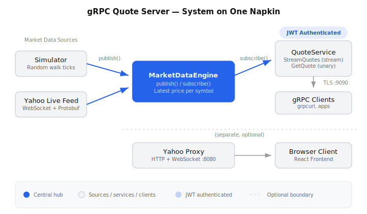
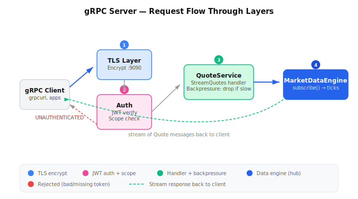
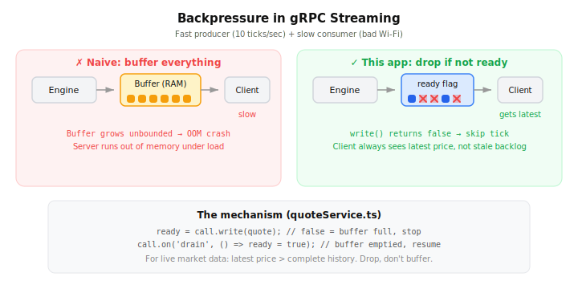

# Building a Realtime Quote Streaming Server with gRPC + TypeScript

*A step-by-step walkthrough for junior developers, from a senior who has wired
this kind of thing up more than once.*

---

## Who this is for

You know some TypeScript and you've built a REST API or two. You've heard the
words "gRPC", "streaming", "JWT", and "backpressure" but you've never put them
together in one service. This article walks through a small-but-real project — a
server that streams live stock quotes to clients — and explains **not just what
each piece does, but why it's there.**

We'll build up the mental model first, then go file by file. By the end you'll
understand a production-shaped streaming service and be able to explain every
moving part in an interview.

> The finished code lives in this repository. As you read, open the file being
> discussed alongside this article — reading the real thing beats reading a
> snippet.

---

## Background: what are we building, and why gRPC?

We want a server that does two things:

1. **Stream** a continuous feed of stock-price "ticks" to many subscribed
   clients at once (prices change several times a second).
2. Answer a quick **"what's the latest price for AAPL?"** request.

Could you do this with plain REST? Sort of — you'd reach for polling or
Server-Sent Events or a raw WebSocket, and you'd hand-roll the message format.
gRPC gives us three things out of the box that fit this problem perfectly:

- **A typed contract** (`.proto` file). The client and server agree on the
  exact shape of every message. No "is it `change_percent` or `changePercent`?"
  guessing.
- **First-class streaming.** "Send one request, get back a stream of responses"
  is a built-in RPC type (`server-streaming`), not something you bolt on.
- **HTTP/2 transport** with binary framing — efficient for high-frequency data.

The trade-off: gRPC is less browser-friendly than REST, and the tooling has a
learning curve. That's exactly why a guided tour helps.

### The 10,000-foot architecture

Here's the whole system on one napkin:

<p align="center">
  
</p>

The single most important idea: **everything funnels through one hub,
`MarketDataEngine`.** A data source *publishes* ticks into it; the gRPC layer
*subscribes* to it. Neither side knows the other exists. This decoupling is the
backbone of the whole design, and we'll keep coming back to it.

---

## Step 0: Project setup

Let's start with the foundation. Three files define the project.

**`package.json`** — the dependencies that matter:

```jsonc
{
  "type": "commonjs",
  "scripts": {
    "build": "tsc -p tsconfig.json",     // type-check + compile to dist/
    "start": "node dist/index.js",        // run the compiled output
    "dev": "tsx watch src/index.ts",      // run TS directly, restart on save
    "test": "node --import tsx --test test/*.test.ts"
  },
  "dependencies": {
    "@grpc/grpc-js": "...",       // pure-JS gRPC implementation
    "@grpc/proto-loader": "...",  // load .proto files at runtime (no codegen)
    "@grpc/reflection": "...",    // lets tools discover our API over the wire
    "jsonwebtoken": "...",        // sign + verify JWTs
    "protobufjs": "...",          // decode Yahoo's binary frames
    "ws": "...",                  // WebSocket client/server
    "dotenv": "..."               // load .env into process.env
  }
}
```

Two things worth pausing on for juniors:

- **`tsx`** lets us run TypeScript without a separate build step during
  development. `npm run dev` watches your files and restarts. In production we
  compile with `tsc` and run plain Node — faster startup, no transpiler in the
  hot path.
- **`@grpc/proto-loader`** loads our contract *at runtime*. Many gRPC tutorials
  use a codegen step that spits out `.ts` files from `.proto`. The runtime
  approach has less ceremony, which is nicer for learning.

**`tsconfig.json`** — the settings that prevent bugs:

```jsonc
{
  "compilerOptions": {
    "strict": true,                  // turn on every type-safety check
    "noUncheckedIndexedAccess": true // arr[i] is T | undefined, not T
  }
}
```

`strict` is non-negotiable on a real project. `noUncheckedIndexedAccess` is the
underrated one: it forces you to handle the case where an array lookup or map
access comes back empty. That's the source of a huge share of real-world
`undefined is not a function` crashes.

---

## Step 1: Define the contract (`proto/quote.proto`)

Before writing any logic, we define *what messages look like*. This is the
single source of truth both sides obey.

```proto
syntax = "proto3";
package quote.v1;

service QuoteService {
  // Server-streaming: one request in, a stream of Quotes back out.
  rpc StreamQuotes(QuoteRequest) returns (stream Quote);

  // Unary: one request, one response. Classic request/response.
  rpc GetQuote(SymbolRequest) returns (Quote);
}

message QuoteRequest { repeated string symbols = 1; }   // "repeated" = array
message SymbolRequest { string symbol = 1; }

message Quote {
  string symbol = 1;
  double price = 2;
  double change = 3;
  double change_percent = 4;
  double bid = 5;
  double ask = 6;
  int64  volume = 7;
  int64  timestamp = 8;        // epoch millis
}
```

The `stream` keyword in front of `Quote` is the whole game. It tells gRPC: "this
call stays open and the server keeps pushing `Quote` messages until someone
hangs up." The numbers (`= 1`, `= 2`) are **field tags** — they're how protobuf
identifies fields on the wire, so they must never change once clients depend on
them.

> **Junior tip:** treat a published `.proto` like a database schema. Adding new
> fields is safe; renaming or renumbering existing ones breaks every client.

---

## Step 2: Load the contract at runtime (`src/grpc/proto.ts`)

Now we turn that `.proto` into something JavaScript can use:

```ts
export const packageDefinition = protoLoader.loadSync(PROTO_PATH, {
  keepCase: true,   // keep field names EXACTLY as written: change_percent
  longs: Number,    // int64 -> plain JS number (not a BigInt/Long object)
  enums: String,
  defaults: true,
  oneofs: true,
});
```

The two options I always have to explain:

- **`keepCase: true`** — by default proto-loader would "helpfully" rename
  `change_percent` to `changePercent`. We turn that off so our objects match the
  proto exactly. Pick a convention and make the tooling respect it.
- **`longs: Number`** — protobuf `int64` is bigger than a JS number can safely
  hold, so libraries often hand you a special `Long` object. For prices and
  millisecond timestamps, a plain `number` is fine and far easier to work with.
  (If you were dealing with astronomical values you'd keep them as `Long` or
  `BigInt` — know your data.)

We also hand-write the matching TypeScript interface so the rest of our code is
type-checked:

```ts
export interface Quote {
  symbol: string;
  price: number;
  change: number;
  change_percent: number;
  bid: number; ask: number;
  volume: number;
  timestamp: number;
}
```

> Because we load the proto at runtime, TypeScript can't *derive* this type for
> us — so we keep the interface and the `.proto` in sync by hand. That's the
> price of skipping codegen. Write a comment reminding the next person.

---

## Step 3: The hub — `MarketDataEngine` (`src/market/marketDataEngine.ts`)

This is the heart of the system. Read this section twice.

The engine holds three things:

```ts
export class MarketDataEngine {
  private readonly book = new Map<string, MarketState>();  // price state per symbol
  private readonly latest = new Map<string, Quote>();      // last tick per symbol
  private readonly listeners = new Set<QuoteListener>();    // who wants ticks
}
```

And it exposes a tiny, deliberate API:

```ts
// A data source calls this to inject a new tick.
publish(quote: Quote): void {
  this.latest.set(quote.symbol, quote);
  for (const listener of this.listeners) listener(quote);  // fan out
}

// A consumer (the gRPC layer) calls this to receive every tick.
// It returns an "unsubscribe" function — call it to stop listening.
subscribe(listener: QuoteListener): () => void {
  this.listeners.add(listener);
  return () => this.listeners.delete(listener);
}

// The latest known price for one symbol (for the unary GetQuote call).
snapshot(symbol: string): Quote | null { /* ... */ }
```

Why this shape matters:

1. **`publish` / `subscribe` is the seam.** The simulator calls `publish`. A
   live Yahoo feed calls `publish`. Tomorrow, a Kafka consumer could call
   `publish`. The gRPC layer only ever calls `subscribe` and `snapshot`. To swap
   data sources you change *nothing* downstream. This is the
   [Observer pattern](https://refactoring.guru/design-patterns/observer), and
   recognizing where to apply it is a senior-level instinct worth building early.

2. **`subscribe` returns its own cleanup function.** This is a really nice
   TypeScript idiom: instead of `subscribe()` + a separate `unsubscribe(listener)`
   where you have to hold onto the exact same reference, you get a closure that
   knows how to remove *this* listener. Harder to misuse.

3. **No locks, no mutexes.** If you came from Java or Go you might reach for a
   concurrent map here. In Node you don't need to: JavaScript runs your code on a
   **single thread**, so a `for` loop over `listeners` can't be interrupted
   half-way by another "thread" mutating the set. Plain `Map`/`Set` are safe.
   Understanding Node's single-threaded event loop is what makes this obviously
   correct rather than scary.

The default data source is a simulator that nudges each price by a small random
amount on a timer — a "random walk":

```ts
start(): void {
  this.timer = setInterval(() => this.tick(), this.tickIntervalMs);
  this.timer.unref?.();   // don't keep the process alive just for this timer
}
```

> **The `unref()` detail** is the kind of thing that separates "works on my
> machine" from "behaves correctly in production." A Node process stays alive as
> long as a timer is pending. `unref()` says "this timer shouldn't, by itself,
> keep the process running" — so `Ctrl-C` and graceful shutdown work cleanly.

---

## Step 4: Stand up the gRPC server (`src/grpc/server.ts`)

Now we expose the engine over gRPC. Here's how the request flows through each layer:

<p align="center">
  
</p>

```ts
export function startGrpcServer(config, engine, jwtService) {
  const server = new grpc.Server();

  const impl = createQuoteService(engine);         // the actual handlers
  const secured = secureService(impl, { ... });    // wrap them in auth (Step 6)
  server.addService(quotePackage.QuoteService.service, secured);

  if (config.grpc.reflection) {
    new ReflectionService(packageDefinition).addToServer(server); // discovery
  }

  const credentials = buildCredentials(config);    // TLS (Step 5)
  return new Promise((resolve, reject) => {
    server.bindAsync(`0.0.0.0:${config.grpc.port}`, credentials, (err, port) => {
      err ? reject(err) : resolve({ server, port, shutdown });
    });
  });
}
```

Three ideas:

- **Reflection** lets tools like `grpcurl` ask the server "what methods do you
  have?" at runtime, so you don't need a copy of the `.proto` to call it. Great
  for debugging; you can disable it in locked-down environments.
- **`bindAsync` is callback-based**, so we wrap it in a `Promise`. Converting
  old-style callback APIs into promises (so you can `await` them) is a everyday
  TypeScript skill — notice the shape.
- We return a **`shutdown()`** function. Always give long-lived resources an
  explicit, awaitable way to close. Your future self writing graceful shutdown
  will thank you.

---

## Step 5: Encrypt the transport with TLS

Quotes aren't state secrets, but auth tokens travel on the same wire — so we use
TLS so nobody can read or tamper with traffic.

```ts
function buildCredentials(config) {
  if (!config.grpc.security.enabled) {
    log.warn('gRPC TLS is DISABLED (GRPC_TLS_ENABLED=false) — do not use in production.');
    return grpc.ServerCredentials.createInsecure();
  }
  const certChain = readFileSync(config.grpc.security.certificateChain);
  const privateKey = readFileSync(config.grpc.security.privateKey);
  return grpc.ServerCredentials.createSsl(null, [{ private_key: privateKey, cert_chain: certChain }], false);
}
```

For local development we generate a **self-signed certificate** with a script
(`./generate-certs.sh`). In production you'd use a certificate from a real
authority (or your cloud load balancer terminates TLS for you).

> **Notice the loud `log.warn`** when security is off. Make dangerous-but-handy
> dev toggles *impossible to forget*. A scary log line on every startup is cheap
> insurance against shipping `TLS_ENABLED=false` to production.

---

## Step 6: Authentication — the interceptor pattern (`src/security/`)

We don't want to copy-paste "check the token" into every handler. Instead we
**wrap** the whole service once. This is the interceptor (a.k.a. middleware)
pattern.

```ts
export function secureService(impl, opts) {
  const wrapped = {};
  for (const [name, handler] of Object.entries(impl)) {
    wrapped[name] = (call, callback) => {
      const authHeader = firstHeader(call, 'authorization');     // "Bearer <jwt>"
      if (!authHeader?.startsWith('Bearer ')) {
        return deny(call, callback, name, 'Missing Authorization header');
      }
      try {
        const principal = opts.jwtService.validate(authHeader.slice(7).trim());
        // Run the real handler WITH the caller's identity available to it:
        principalStore.run(principal, () => handler(call, callback));
      } catch (err) {
        deny(call, callback, name, `Invalid token: ${err.message}`);
      }
    };
  }
  return wrapped;
}
```

Two senior-level techniques are hiding in those few lines.

### 6a. Validate the JWT (`jwtService.ts`)

A JWT is a signed token that proves "the bearer is who they say they are." We
verify the signature, expiry, and (optionally) issuer/audience, then translate
the token's claims into our own `GrpcPrincipal` object:

```ts
constructor(secret: string, ...) {
  if (Buffer.byteLength(secret, 'utf8') < 32) {
    throw new Error('JWT_SECRET must be at least 32 bytes (256 bits) for HS256');
  }
  // ...
}
```

> That length check is a real, easy-to-miss security requirement: HS256 wants a
> key of at least 256 bits. We **fail loudly at startup** rather than silently
> accepting a weak secret. Fail fast, fail early, fail visibly.

### 6b. Carry identity without threading it everywhere — `AsyncLocalStorage`

Here's the elegant part. The handler needs to know *who is calling* — but we
don't want to add a `principal` parameter to every function. Node's
`AsyncLocalStorage` gives us per-request context that "follows" the async call
chain automatically:

```ts
// grpcSecurityContext.ts
export const principalStore = new AsyncLocalStorage<GrpcPrincipal | undefined>();
export function currentPrincipal() { return principalStore.getStore(); }
```

The interceptor does `principalStore.run(principal, () => handler(...))`, and
*anywhere* inside that handler — even in callbacks fired later — we can call
`currentPrincipal()` and get the right caller. It's like
[React context](https://react.dev/learn/passing-data-deeply-with-context) but
for a server request. If you've ever passed a `userId` argument through five
function layers just to use it at the bottom, this is the cure.

Then the actual handler enforces *authorization* (what this user is allowed to
do) on top of *authentication* (who they are):

```ts
const SCOPE_READ = 'quotes:read';
function allowed(principal) {
  return principal == null || principal.hasScope(SCOPE_READ);
}
```

> **Authentication vs. authorization** trips up every junior. Authentication =
> "who are you?" (the valid JWT). Authorization = "are you allowed to do this?"
> (do you have the `quotes:read` scope?). Different questions, different layers.

---

## Step 7: The streaming handler — and backpressure (`src/grpc/quoteService.ts`)

This is where it all comes together. A client calls `StreamQuotes`, and we
subscribe them to the engine:

```ts
function streamQuotes(call) {
  // Empty request == "send me everything you track."
  const requested = call.request.symbols?.length
    ? new Set(call.request.symbols.map(s => s.trim().toUpperCase()))
    : engine.symbols();

  let ready = true;
  call.on('drain', () => { ready = true; });          // transport buffer emptied

  const unsubscribe = engine.subscribe((quote) => {
    if (!requested.has(quote.symbol) || call.cancelled || !ready) return;
    ready = call.write(quote);   // write() returns false if the buffer is full
  });

  // Clean up the moment the client goes away — no leaks.
  call.on('cancelled', unsubscribe);
  call.on('close', unsubscribe);
  call.on('error', unsubscribe);
}
```

### The most important concept in this whole article: backpressure

Imagine a fast producer (prices tick 10×/second) and a slow consumer (a client
on bad Wi-Fi). If you naively `write()` every tick, Node buffers the ones the
client can't keep up with — **in memory, without limit.** Under load, that's how
servers run out of RAM and fall over.

<p align="center">
  
</p>

`call.write()` returns a boolean: **`false` means "the buffer is full, stop
sending."** We track that in a `ready` flag and simply skip ticks until the
`'drain'` event fires (the buffer has emptied). For *live* market data this is
exactly right: a slow client should get the *latest* price, not a backlog of
stale ones. We **drop, not buffer.**

> Whenever you have a producer and consumer running at different speeds, ask:
> "what happens when the consumer can't keep up?" If you don't have an answer,
> you have a future outage. Backpressure is the answer.

### Don't forget cleanup

Every `subscribe` must be paired with an `unsubscribe`, and we wire it to *every*
way a client can disappear: `cancelled`, `close`, `error`. Forget this and you
have a **memory leak** — dead listeners piling up in the engine's `Set`, each
holding a reference to a closed connection. Leaks like this are invisible in
dev and lethal in production.

---

## Step 8: Configuration via environment variables (`src/config.ts`)

Hard-coding ports and secrets is a rookie move. We read everything from the
environment, with sensible defaults and small typed helpers:

```ts
function env(name: string, fallback: string): string {
  const v = process.env[name];
  return v === undefined || v === '' ? fallback : v;
}
function envBool(name, fallback) { /* "true" -> true */ }
function envInt(name, fallback)  { /* parse, fall back if NaN */ }

export function loadConfig(): Config {
  return {
    grpc: {
      port: envInt('GRPC_PORT', 9090),
      security: {
        enabled: envBool('GRPC_TLS_ENABLED', true),
        certificateChain: env('GRPC_TLS_CERT', 'certs/server.crt'),
        privateKey: env('GRPC_TLS_KEY', 'certs/server.key'),
      },
    },
    security: {
      enabled: envBool('AUTH_ENABLED', true),
      jwt: { secret: env('JWT_SECRET', 'dev-only-...'), /* ... */ },
    },
    // ...
  };
}
```

This follows the [Twelve-Factor App](https://12factor.net/config) rule: **config
lives in the environment, not in code.** The same compiled artifact runs in dev,
staging, and prod — only the env vars differ. Defaults make local dev
zero-config; overrides make production safe.

### Loading a `.env` file — and a real gotcha

Typing `GRPC_PORT=... AUTH_ENABLED=... JWT_SECRET=...` before every command gets
old fast. `dotenv` reads a `.env` file into `process.env` for us. We add **one
line** at the very top of the entry point:

```ts
// src/index.ts
import 'dotenv/config';            // <-- MUST be the first import
import { getLogger } from './logger';
import { loadConfig } from './config';
```

Now — **why "first import"?** This bit me, and it's a fantastic lesson about how
modules actually load. Our logger computes its log level *the moment its module
is evaluated*:

```ts
// logger.ts (runs once, at import time)
const threshold = ORDER[process.env.LOG_LEVEL ?? 'info'] ?? ORDER.info;
```

JavaScript evaluates imported modules **in the order they're imported, before**
the importing file's own code runs. If `./logger` were imported before
`dotenv/config`, the logger would read `LOG_LEVEL` *before* `.env` was loaded —
and your `LOG_LEVEL=debug` in `.env` would be silently ignored. Putting
`import 'dotenv/config'` first guarantees `.env` populates `process.env` before
any other module reads it.

> **The lesson:** import order is execution order, and side-effects at module
> load time are sneaky. When something "isn't picking up my env var," ask *when*
> in the startup sequence that value gets read. We even wrote a tiny throwaway
> script to prove the ordering before trusting it — verifying assumptions beats
> hoping.

We ship a `.env.example` documenting every variable at its default, and we
`.gitignore` the real `.env` so secrets never get committed.

---

## Step 9: Wire it all together (`src/index.ts`)

The entry point is small precisely *because* each piece is self-contained:

```ts
import 'dotenv/config';
// ...
async function main() {
  const config = loadConfig();

  const engine = new MarketDataEngine(config.market.source, config.market.tickIntervalMs);
  engine.seed();

  if (config.market.source === 'yahoo') {
    new YahooStreamClient(engine, ...).start();   // live feed -> engine.publish
  } else {
    engine.start();                                // simulator -> engine.publish
  }

  const jwtService = new JwtService(config.security.jwt.secret, ...);
  const grpc  = await startGrpcServer(config, engine, jwtService);
  const proxy = config.proxy.enabled ? await startProxyServer(config) : undefined;

  // Shut everything down cleanly on Ctrl-C / container stop.
  const shutdown = async (signal) => {
    engine.stop();
    await Promise.allSettled([grpc.shutdown(), proxy?.shutdown()]);
    process.exit(0);
  };
  process.on('SIGINT',  () => void shutdown('SIGINT'));
  process.on('SIGTERM', () => void shutdown('SIGTERM'));
}
```

Notice the **dependency injection** by hand: we *create* the engine and jwt
service, then *pass* them into the server. The server doesn't reach out and
construct its own dependencies. That's what made the auth and the engine easy to
swap and — crucially — easy to test.

And notice graceful shutdown handling `SIGINT`/`SIGTERM`. In a container, a
deploy sends `SIGTERM`; handling it lets in-flight work finish and connections
close cleanly instead of being severed.

---

## Step 10: Test it (`test/`)

We use Node's **built-in** test runner — no Jest, no extra config:

```ts
// node --import tsx --test test/*.test.ts
import { test } from 'node:test';
import assert from 'node:assert';

test('GetQuote returns a seeded symbol', async () => {
  const h = await startHarness();          // real server on a random port
  const quote = await getQuote(h.client, { symbol: 'AAPL' });
  assert.equal(quote.symbol, 'AAPL');
  await h.close();
});
```

The trick that makes these tests fast and trustworthy: a **test harness**
(`grpcHarness.ts`) spins up a real gRPC server on an ephemeral port (`127.0.0.1:0`
— "pick any free port"), with a real engine, and a connected client. We test the
actual wire path, not a mock of it. Because the pieces take their dependencies as
arguments (Step 9), we can assemble a server with auth on or off in two lines.

The suite covers the things most likely to break: a valid token works, a
missing/forged/expired token is rejected, a caller missing the `quotes:read`
scope is denied, and the stream emits an immediate snapshot. **Test your
security rules explicitly** — those are exactly the bugs that hurt most.

---

## Step 11: Run it and poke at it

```bash
npm install
./generate-certs.sh        # one-time: create local TLS certs
npm run dev                # start everything
```

On startup the server prints a ready-to-use **dev JWT** (because
`PRINT_DEV_TOKEN=true`). Copy it and call the API with
[`grpcurl`](https://github.com/fullstorydev/grpcurl):

```bash
TOKEN=<paste the dev JWT from the logs>

# Latest snapshot (unary):
grpcurl -cacert certs/server.crt -H "authorization: Bearer $TOKEN" \
  -d '{"symbol":"AAPL"}' localhost:9090 quote.v1.QuoteService/GetQuote

# Live stream (Ctrl-C to stop). Empty symbols = everything:
grpcurl -cacert certs/server.crt -H "authorization: Bearer $TOKEN" \
  -d '{"symbols":["AAPL","NVDA"]}' localhost:9090 quote.v1.QuoteService/StreamQuotes
```

Try it without the token — you'll get `UNAUTHENTICATED` and the call never
reaches a handler. That's the interceptor from Step 6 doing its job. Seeing the
auth boundary actually reject you is the best way to trust it.

Want *real* prices instead of the simulator? Flip one env var:

```bash
MARKET_SOURCE=yahoo npm run dev
```

Because of the `publish`/`subscribe` seam from Step 3, **the gRPC layer doesn't
change at all.** That payoff — change the data source, touch nothing
downstream — is the whole reason we built it this way.

---

## The takeaways (save these)

If you remember nothing else, remember these patterns — they show up everywhere,
not just in gRPC:

1. **Decouple with a hub.** Producers `publish`, consumers `subscribe`, neither
   knows the other. Swapping one side becomes trivial.
2. **Backpressure is mandatory** whenever producer and consumer run at different
   speeds. Decide *up front* whether you drop or buffer. "Buffer forever" is
   never the answer.
3. **Always pair `subscribe` with `unsubscribe`,** wired to every disconnect
   path. Unbounded listener sets are silent memory leaks.
4. **Cross-cutting concerns (auth, logging) belong in one wrapper,** not
   copy-pasted into every handler. Interceptors/middleware keep handlers focused.
5. **Carry request context with `AsyncLocalStorage`,** not by threading a
   parameter through every function.
6. **Config comes from the environment.** Same artifact everywhere; behavior set
   by env vars; secrets never in git.
7. **Import order is execution order.** Side-effects at module-load time
   (like reading env vars) are order-sensitive. When something ignores your
   config, ask *when* it's read.
8. **Fail fast and loud** on bad config (weak secret, disabled TLS). A scary
   startup log beats a quiet production incident.
9. **Inject dependencies** so your code is testable. If a thing is hard to test,
   it's usually too tightly coupled.
10. **Always provide a `shutdown()`** and handle `SIGTERM`. Clean teardown is a
    feature, not an afterthought.

None of these are gRPC-specific. They're the habits that turn "it works" into
"it works in production." Build them now, while the project is small enough to
hold in your head.

Now go open the real files and trace one tick all the way from `engine.publish`
to a byte on the wire. That walk is worth more than re-reading this article.

*— happy shipping*
